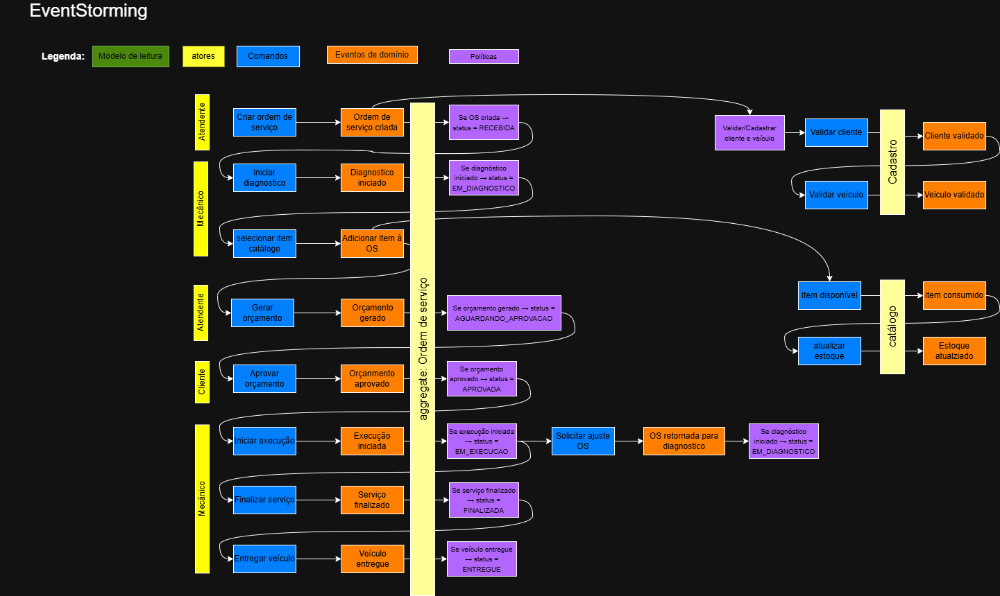
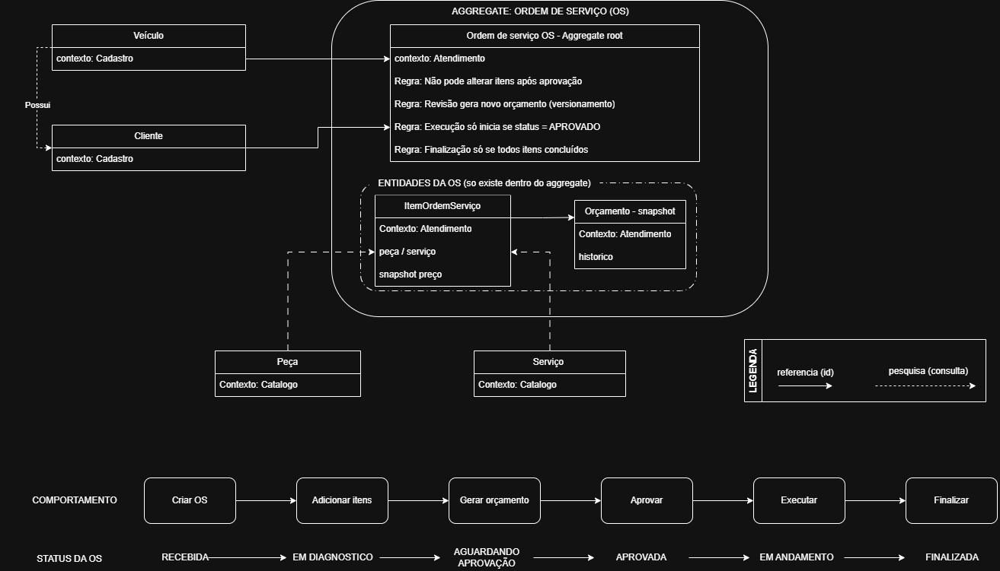
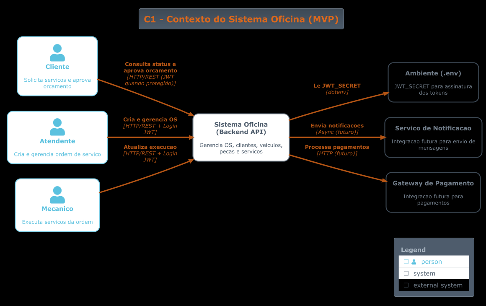
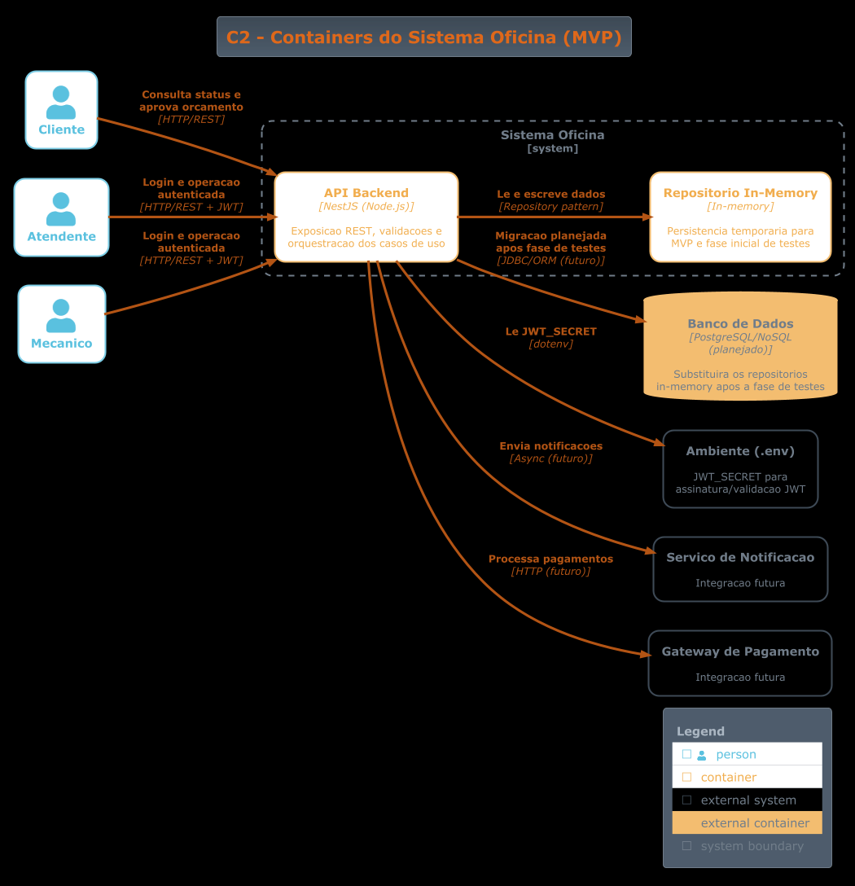
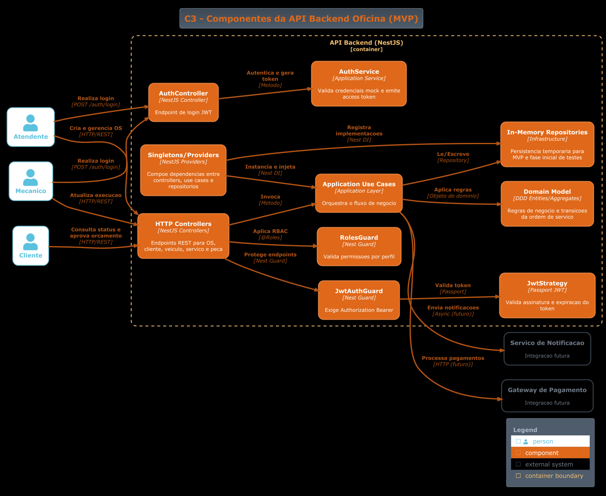
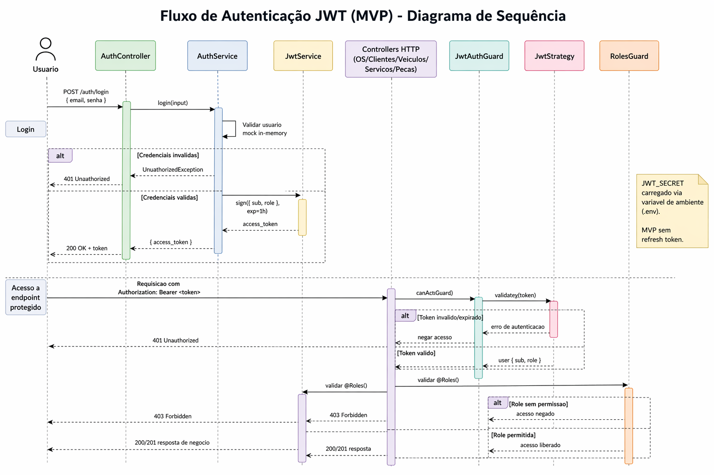
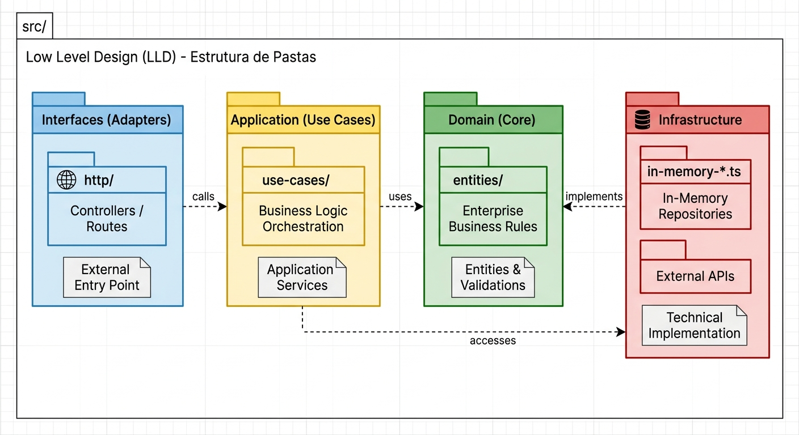

# Documentação de Arquitetura — Oficina mecânica (MVP)

- Projeto: Tech challenge — Software Architecture — Fase 2
- Autor: Marcos Renan Silva Faria (RM373221) — Discord: natsumetks
- Data: 

## Sumário

- [1. Introdução](#1-introdução)
- [2. Requisitos](#2-requisitos)
- [3. Modelagem de Domínio (DDD)](#3-modelagem-de-domínio-ddd)
- [4. Arquitetura (Clean Architecture)](#4-arquitetura-clean-architecture)
- [5. API](#5-api)
- [6. Segurança](#6-segurança)
- [7. Testes](#7-testes)

## Entregáveis

- Drawio (online): https://drive.google.com/file/d/1Gv8bTQnPdIEIPBtMnt4wfpOyKGaOIXs8/view?usp=sharing
- Drawio (local): [../oficina-mecanica-drawio.drawio](../oficina-mecanica-drawio.drawio)
- DAS: [DAS.md](DAS.md)
- Contexto: [contexto.md](contexto.md)
- Débitos técnicos: [debitos_tecnicos.md](debitos_tecnicos.md)
- Relatório Sonar: [relatorios/sonar-relatorio-final.md](relatorios/sonar-relatorio-final.md)
- README: [../README.md](../README.md)
- Repositório: https://github.com/marcosrenansilvafaria-afk/oficina-fiap.git
- Vídeo (demonstração em 07:50:00): [docs/video/apresentacao-fase-1.txt](./video/apresentacao-fase-1.txt)


---

# 1. Introdução

## 1.1 Contexto do problema

A oficina mecânica enfrentava problemas operacionais devido ao uso de processos manuais e planilhas, resultando em:

- Falhas no controle de serviços
- Dificuldade no acompanhamento do status das ordens
- Perda de histórico de clientes e veículos
- Ineficiência no fluxo de aprovação de orçamentos

O sistema proposto busca centralizar e organizar esses processos, garantindo rastreabilidade e controle.

## 1.2 Objetivo do sistema

Desenvolver um backend (MVP) para gestão de Ordens de Serviço (OS), permitindo:

- Controle do ciclo completo de atendimento
- Organização dos dados de clientes e veículos
- Gestão de serviços e peças
- Acompanhamento do status da OS via API

Critérios de sucesso do MVP:

- Garantir rastreabilidade de ponta a ponta do fluxo da OS (criação até entrega)
- Manter consistência das transições de status por regra de domínio
- Permitir consulta operacional de OS e cadastros com resposta estável via API

## 1.3 Escopo do MVP

- Ordens de Serviço (OS)
- Clientes
- Veículos
- Serviços
- Peças

Fora do escopo (MVP / Fase 1):

- Autenticação JWT avançada (refresh token, revogação e rotação)
- Monitoramento avançado (tempo médio e KPIs complexos)
- Controle avançado de estoque

Escopo adicionado na Fase 2:

- Persistência relacional (PostgreSQL via Prisma 7)
- API de consulta de status da OS
- Webhook de aprovação/recusa de orçamento
- Listagem ordenada de OS com filtro de status encerrados
- Notificação simulada de alteração de status (e-mail via console)

Observação de escopo: autenticação JWT foi implementada de forma simplificada no MVP (access token).

---

# 2. Requisitos

## 2.1 Requisitos Funcionais

### 2.1.1 Fluxo de OS

- **RF-OS-01: Gestão de Ordem de Serviço (ALTO IMPACTO)**
  - Funcionalidades: Criação de OS, associação com cliente e veículo, inclusão de serviços e peças, geração automática de orçamento, aprovação de orçamento, execução, finalização, entrega do veículo e consulta de OS.
  - Status da OS: RECEBIDA, EM_DIAGNOSTICO, AGUARDANDO_APROVACAO, APROVADA, EM_EXECUCAO, FINALIZADA, ENTREGUE.
  - Implementação no repositório: núcleo do domínio implementado com controle de estados.

- **RF-OS-02: Criar Ordem de Serviço**
  - Entrada: `clienteId`, `veiculoId`.
  - Validação: cliente e veículo devem existir.

- **RF-OS-03: Adicionar itens**
  - Permitido apenas em: RECEBIDA, EM_DIAGNOSTICO.
  - Tipos: `SERVICO` | `PECA`.

- **RF-OS-04: Gerar orçamento**
  - Soma automática dos itens e snapshot de preços.

- **RF-OS-05: Aprovar orçamento**
  - Altera status para `APROVADA`.

- **RF-OS-06: Iniciar execução**
  - Apenas se status = `APROVADA`.

- **RF-OS-07: Finalizar OS**
  - Apenas se status = `EM_EXECUCAO`.

- **RF-OS-08: Entregar veículo**
  - Apenas se status = `FINALIZADA`.

- **RF-OS-09: Consultar OS**
  - `GET` por id e listagem geral.

- **RF-OS-10: Consultar status da OS (Fase 2)**
  - `GET /os/:id/status` retorna `{ id, status, statusLabel }` com label em PT-BR.
  - Status possíveis: RECEBIDA, EM_DIAGNOSTICO, AGUARDANDO_APROVACAO, APROVADA, EM_EXECUCAO, FINALIZADA, ENTREGUE.

- **RF-OS-11: Webhook de aprovação/recusa de orçamento (Fase 2)**
  - `POST /os/:id/orcamento/webhook` com body `{ "aprovado": true | false }`.
  - `aprovado: true` transiciona para APROVADA; `aprovado: false` retorna para EM_DIAGNOSTICO.

- **RF-OS-12: Listagem ordenada de OS (Fase 2)**
  - `GET /os` retorna OS ativas ordenadas por prioridade operacional:
    1. EM_EXECUCAO
    2. APROVADA
    3. AGUARDANDO_APROVACAO
    4. EM_DIAGNOSTICO
    5. RECEBIDA
  - OS com status FINALIZADA e ENTREGUE são ocultadas da listagem.
  - Desempate pelo campo `criadaEm ASC` (mais antigas primeiro).

- **RF-OS-13: Notificação de alteração de status (Fase 2)**
  - A cada transição de status, um e-mail simulado é emitido via `console.log`.
  - Implementado por `ConsoleEmailNotificador` (porta `NotificadorStatus` na camada de aplicação).

### 2.1.2 Gestão administrativa

- **RF-ADM-01: Cliente**
  - Criar cliente (CPF/CNPJ), buscar cliente.

- **RF-ADM-02: Veículo**
  - Criar veículo (placa, modelo, marca, ano), buscar veículo.

- **RF-ADM-03: Peças**
  - Cadastro simples, controle básico de estoque (campo numérico).

- **RF-ADM-04: Serviços**
  - Cadastro simples.

- **RF-ADM-05: Relatórios**
  - Não implementado no MVP (fora do escopo).

## 2.2 Requisitos Não Funcionais

### 2.2.1 Arquitetura

- Monólito em camadas com DDD aplicado no domínio e Clean Architecture para separar responsabilidades.
- Camadas: Domain, Application (use-cases), Interfaces (HTTP/controllers), Infrastructure (repositórios).
- Implementação atual (Fase 2): persistência relacional com **PostgreSQL 16** via **Prisma 7** (`@prisma/adapter-pg`, driver adapter). [ADR-006](./adr/ADR-006-estrategia-persistencia-pos-mvp.md)
- Seam de repositório em `src/infraestructure/singletons.ts`: testes usam repositórios in-memory; runtime usa repositórios Prisma (swap ocorre em `main.ts` antes do `NestFactory.create`).

### 2.2.2 Segurança

- Validação de entrada: campos obrigatórios, formato de documento (CPF/CNPJ), placa e tipos de item da OS.
- Validação de regra: transições de estado e pré-condições da OS são validadas no domínio.
- Autenticação/autorização: JWT (access token) e RBAC básico implementados no MVP.
- Política de token: payload mínimo (`sub`, `role`) e expiração padrão de 1h.
- Sem refresh token no MVP: decisão intencional para reduzir complexidade inicial em ambiente controlado.
- Tratamento de erro: padronização de erros de validação e regra de negócio deve ser aplicada na camada HTTP (plano de evolução).

### 2.2.3 Performance

- Persistência relacional (PostgreSQL) com Prisma 7 e driver nativo `pg` (sem overhead de conversão de protocolo).
- Repositórios in-memory mantidos como test doubles — execução de testes sem dependência de banco.

### 2.2.4 Testes

- Testes automatizados parciais: testes de domínio e testes de fluxo principal (E2E) parcialmente implementados.

### 2.2.5 Deploy

- Aplicação containerizada com Docker (`Dockerfile`) e orquestração local via `docker-compose.yml`.
- `docker-compose.yml` contém dois serviços: `api` e `postgres` (imagem `postgres:16-alpine`).
- Migrations aplicadas via `npx prisma migrate deploy` antes do start da API.

---

# 3. Modelagem de Domínio (DDD)

## 3.1 Linguagem Ubíqua

O sistema utiliza uma linguagem ubíqua alinhada ao domínio de oficinas mecânicas, garantindo consistência entre código, documentação e regras de negócio.

### Termos principais

- Ordem de Serviço (OS): representa o ciclo completo de atendimento de um veículo
- Cliente: solicitante do serviço
- Veículo: objeto do atendimento
- Item da OS: componente da ordem (serviço ou peça)
- Serviço: atividade executada (ex: troca de óleo)
- Peça: insumo utilizado

### Status da Ordem de Serviço

- RECEBIDA
- EM_DIAGNOSTICO
- AGUARDANDO_APROVACAO
- APROVADA
- EM_EXECUCAO
- FINALIZADA
- ENTREGUE

### Ações do domínio

- Diagnosticar
- Gerar orçamento
- Aprovar orçamento
- Recusar orçamento (Fase 2)
- Executar serviço
- Finalizar OS
- Entregar veículo

## 3.2 Event Storming

- Fluxo Principal (extraído do contexto do projeto):
  1. Criar OS (cliente + veículo)
  2. Iniciar diagnóstico
  3. Adicionar itens
  4. Gerar orçamento
  5. Aprovar orçamento
  6. Executar
  7. Finalizar
  8. Entregar
  
  


## 3.3 Entidades e Agregados

O domínio foi modelado utilizando o conceito de Aggregate do Domain-Driven Design, garantindo consistência e controle das regras de negócio.

### 3.3.1 Bounded Contexts (visão atual)

- Contexto Ordem de Serviço (núcleo): concentra regras transacionais e ciclo de vida da OS.
- Contexto Cadastro: cliente e veículo como entidades referenciadas por identificador.
- Contexto Catálogo: serviços e peças usados como base para composição dos itens da OS.

Observação arquitetural: no estado atual do MVP, os contextos convivem no mesmo monólito modular. A separação é lógica (domínio e responsabilidades) e não física (serviços independentes).

### Aggregate Root

#### OrdemServico

A entidade OrdemServico é o Aggregate Root do sistema, sendo responsável por:

- Controlar o ciclo de vida da OS
- Garantir as regras de negócio
- Gerenciar os itens associados
- Controlar o status da operação

Apenas o Aggregate Root pode ser manipulado diretamente por outros componentes do sistema.

  

---

### Entidades internas ao Aggregate

#### ItemOrdemServico

Representa um item dentro da Ordem de Serviço.

Pode ser de dois tipos:
- SERVICO (mão de obra)
- PECA (insumo)

Atributos:
- tipo
- descricao
- preco
- quantidade

Observação:
Os itens não existem fora do contexto da OrdemServico.

---

### Entidades externas ao Aggregate

#### Cliente (Bounded Context: Cadastro)

Representa o solicitante do serviço.

Atributos:
- id
- nome
- documento (CPF/CNPJ)

Observação:
É referenciado pela OrdemServico, mas não pertence ao aggregate.

---

#### Veiculo (Bounded Context: Cadastro)

Representa o veículo atendido.

Atributos:
- id
- placa
- marca
- modelo
- ano

Observação:
Assim como Cliente, é uma entidade externa referenciada.

---

#### Serviço (Bounded Context: Catálogo)

Define os tipos de serviços disponíveis.

---

#### Peça (Bounded Context: Catálogo)

Define os insumos disponíveis para utilização.

---

### Consistência do Aggregate

Todas as regras de negócio são garantidas dentro do Aggregate OrdemServico, incluindo:

- Controle de status
- Inclusão de itens
- Transições de estado
- Validação de fluxo

Isso garante consistência de regra de negócio no contexto do MVP e no fluxo operacional previsto.

## 3.4 Regras de Negócio

As regras de negócio foram centralizadas no Aggregate OrdemServico, garantindo consistência e previsibilidade no fluxo do sistema.

---

### Regras de criação

- Uma Ordem de Serviço só pode ser criada se:
  - Cliente existir
  - Veículo existir

---

### Regras de itens

- Itens só podem ser adicionados nos status:
  - RECEBIDA
  - EM_DIAGNOSTICO

- Ao adicionar um item:
  - O valor total da OS deve ser recalculado

---

### Regras de orçamento

- O orçamento deve ser gerado antes da aprovação
- Ao gerar orçamento:
  - Status muda para AGUARDANDO_APROVACAO

---

### Regras de aprovação

- Apenas ordens em AGUARDANDO_APROVACAO podem ser aprovadas
- Após aprovação:
  - Status muda para APROVADA

---

### Regras de execução

- Execução só pode iniciar se:
  - Status = APROVADA

- Ao iniciar execução:
  - Status muda para EM_EXECUCAO

---

### Regras de finalização

- A OS só pode ser finalizada se:
  - Status = EM_EXECUCAO

- Após finalização:
  - Status muda para FINALIZADA

---

### Regras de entrega

- A OS só pode ser entregue se:
  - Status = FINALIZADA

- Após entrega:
  - Status muda para ENTREGUE

---

### Regras de recusa de orçamento (Fase 2)

- Recusa é acionada via `POST /os/:id/orcamento/webhook` com `{ "aprovado": false }`.
- Apenas ordens em AGUARDANDO_APROVACAO podem ser recusadas.
- Após recusa:
  - Status retorna para EM_DIAGNOSTICO (reabre para novo diagnóstico e reorçamento).
  - Essa transição também dispara notificação de alteração de status.

### Regras de ajuste (fluxo alternativo)

- É possível retornar a OS para diagnóstico quando:
  - Status = AGUARDANDO_APROVACAO

- Esse fluxo permite:
  - Inclusão de novos itens
  - Regeração de orçamento

---

### Regras de integridade

- Não é permitido pular estados
- Todas as transições devem seguir o fluxo definido
- Todas as validações são realizadas dentro do Aggregate

Regras explicitamente fora do escopo desta etapa:

- Controle transacional de concorrência em nível de banco (será tratado após migração de persistência)
- Estratégia de cancelamento de OS em estados avançados (a definir em evolução de negócio)
- Reserva de estoque com lock otimista/pessimista (planejado para fase com banco relacional)

# 4. Arquitetura de Software

## 4.1 Visão Geral

- Arquitetura adotada: DDD + Clean Architecture em aplicação NestJS.
- Descrição: monolito modular com separação clara entre domínio, casos de uso, interfaces e infra.

Diagramas de arquitetura (C4) criados em plantUML como exemplificado na "Aula 3 - Modelos e Diagramas de Arquitetura: C4 Model".

- C1 (Contexto): `./diagram/C1_Oficina_Context.puml`
- C2 (Containers): `./diagram/C2_Oficina_Container.puml`
- C3 (Componentes): `./diagram/C3_Oficina_Component.puml`
- Fluxo de autenticação (sequência): `.diagram/fluxoAutenticacao.puml`

Observação: o nível C4 (código) será elaborado em etapa posterior por ser mais orientado a desenvolvedores e depender da estabilização final dos módulos internos.

## 4.2 Modelo C4

### 4.2.1 Contexto

- Sistema: Backend da Oficina (MVP) — expõe API para front-end/consumidores.
- Usuários: clientes, atendentes e mecânicos.



### 4.2.2 Containers

- API (NestJS) — aplica casos de uso; endpoints REST.
- PostgreSQL 16 — banco relacional; persistência durável de todas as entidades.
- Repositórios Prisma (`src/infraestructure/repositories/prisma-*.repository.ts`) — adaptadores que implementam as interfaces de domínio usando `PrismaClient` com driver `PrismaPg`.
- Repositórios In-Memory (`src/infraestructure/in-memory-*.repository.ts`) — test doubles; usados exclusivamente nos testes unitários via seam em `singletons.ts`.
- Serviços externos (opcional): gateway de pagamentos, serviço de notificações.



### 4.2.3 Componentes

- Controllers (HTTP) — adaptadores de entrada: `src/interfaces/http/*`.
- Use-Cases / Application Services — `src/application/use-cases/*`.
- Ports (Application) — `src/application/ports/notificador-status.ts` (interface para notificação de status).
- Domain Entities — `src/domain/entities/*`.
- Repositories (Infra) — `src/infraestructure/repositories/prisma-*.repository.ts` (Prisma, runtime) e `src/infraestructure/in-memory-*.repository.ts` (test doubles).
- Notificador (Infra) — `src/infraestructure/notificacao/console-email-notificador.ts` (implementa `NotificadorStatus`, simula e-mail via `console.log`).
- Schema Prisma — `prisma/schema.prisma`; migrations em `prisma/migrations/`.



### 4.2.4 Fluxo de autenticação JWT (sequência)

- Login via `POST /auth/login` retorna `access_token` com expiração de 1h.
- Endpoints protegidos usam `Authorization: Bearer <token>`.
- Validação ocorre com `JwtAuthGuard` + `JwtStrategy` e autorização com `RolesGuard`.



## 4.3 Low Level Design (LLD)

- Estrutura de código (Fase 2):

```
src/
  domain/
    entities/           ← regras de negócio puras
    repositories/       ← interfaces I*Repository
  application/
    use-cases/          ← orquestração assíncrona
    ports/              ← NotificadorStatus (interface)
  interfaces/
    http/               ← controllers, DTOs, mapper de status
  infraestructure/
    in-memory-*.ts      ← test doubles (async)
    repositories/       ← prisma-*.repository.ts (runtime)
    prisma/             ← PrismaService, PrismaModule
    notificacao/        ← ConsoleEmailNotificador
    singletons.ts       ← seam de runtime vs. teste
prisma/
  schema.prisma         ← modelos e enums Prisma
  migrations/           ← migrations geradas
generated/
  prisma/client/        ← PrismaClient gerado (não versionar)
```

- Camadas e responsabilidades: Domain (regras), Application (orquestra use-cases + porta de notificação), Interfaces (adapters HTTP), Infrastructure (repositórios Prisma e in-memory, notificador, singletons).

Aderência arquitetural (Fase 2):

- Repositórios desacoplados por interfaces `I*Repository` — use cases dependem de contrato, não de implementação.
- Porta `NotificadorStatus` na camada Application; implementação `ConsoleEmailNotificador` na infra (Dependency Inversion completo).
- Seam em `singletons.ts` isola testes de banco sem uso de mocks pesados (pattern testable-by-default).
- Para produção: manter consolidação de erros de domínio → HTTP e adicionar transações Prisma nos fluxos de escrita da OS.


## 4.4 Decisões Arquiteturais (ADR)

Este projeto registra decisões arquiteturais importantes como ADRs (Architecture Decision Records). As ADRs foram organizadas em arquivos individuais no diretório `docs/adr/`.

Índice de ADRs:

- [ADR-001-ddd-modelagem-dominio.md](adr/ADR-001-ddd-modelagem-dominio.md) — modelagem inicial do domínio com DDD.
- [ADR-002-clean-architecture-camadas.md](adr/ADR-002-clean-architecture-camadas.md) — separação por camadas e responsabilidades.
- [ADR-003-persistencia-in-memory-mvp.md](adr/ADR-003-persistencia-in-memory-mvp.md) — persistência in-memory no MVP.
- [ADR-004-nestjs-backend.md](adr/ADR-004-nestjs-backend.md) — adoção de NestJS + TypeScript.
- [ADR-005-monolito-modular-mvp.md](adr/ADR-005-monolito-modular-mvp.md) — monólito modular como estratégia inicial.
- [ADR-006-estrategia-persistencia-pos-mvp.md](adr/ADR-006-estrategia-persistencia-pos-mvp.md) — estratégia de evolução de persistência.
- [ADR-007-jwt-rbac.md](adr/ADR-007-jwt-rbac.md) — JWT e RBAC no MVP.
- [ADR-008-estrategia-testes-quality-gate.md](adr/ADR-008-estrategia-testes-quality-gate.md) — estratégia de testes e quality gate.
- [ADR-009-versionamento-api.md](adr/ADR-009-versionamento-api.md) — versionamento da API.
- [ADR-010-observabilidade-minima-erros.md](adr/ADR-010-observabilidade-minima-erros.md) — observabilidade mínima e tratamento de erros.
---

# 5. API

## 5.1 Endpoints

Endpoints mapeados a partir dos controllers da aplicação (prefixos reais de rota):

### Ordem de Serviço (`/os`)

- `POST /os`
  - Descrição: cria uma OS.
  - Request (exemplo):
    ```json
    {
      "clienteId": "uuid-opcional",
      "veiculoId": "uuid-opcional"
    }
    ```
  - Respostas:
    - `200`: OS criada.
    - `400`: `clienteId`/`veiculoId` inválidos.

- `POST /os/:id/diagnostico`

- `POST /os/:id/item`
  - Descrição: adiciona item (serviço/peça) à OS.
  - Request (exemplo):
    ```json
    {
      "tipo": "SERVICO",
      "idReferencia": "uuid-servico-ou-peca",
      "quantidade": 1
    }
    ```
  - Respostas:
    - `200`: item adicionado.
    - `404`: OS não encontrada.
    - `400`: violação de regra de domínio.

- `POST /os/:id/orcamento`
- `POST /os/:id/enviar-orcamento`
- `POST /os/:id/aprovar`
- `POST /os/:id/executar`
- `POST /os/:id/finalizar`
- `POST /os/:id/entregar`

- `GET /os/:id/status` **(Fase 2)**
  - Descrição: retorna status atual da OS com label em PT-BR.
  - Respostas:
    - `200`: `{ "id": "...", "status": "EM_EXECUCAO", "statusLabel": "Em Execução" }`
    - `404`: OS não encontrada.

- `POST /os/:id/orcamento/webhook` **(Fase 2)**
  - Descrição: notificação externa de decisão do cliente sobre o orçamento.
  - Request: `{ "aprovado": true }` ou `{ "aprovado": false }`
  - Respostas:
    - `200`: transição aplicada.
    - `400`: status incorreto para aprovação/recusa.
    - `404`: OS não encontrada.

- `GET /os/:id`
  - Descrição: consulta OS por identificador.
  - Respostas: `200`/`404`.

- `GET /os`
  - Descrição: lista OS ativas ordenadas por prioridade operacional (EM_EXECUCAO > APROVADA > AGUARDANDO_APROVACAO > EM_DIAGNOSTICO > RECEBIDA). OS com status FINALIZADA/ENTREGUE são omitidas.

- `GET /os/sla-atendimento`
  - Descrição: métrica de SLA médio (criação -> finalização), considerando apenas OS em status `FINALIZADA`.
  - Respostas comuns:
    - `200`: métrica calculada.

### Clientes (`/clientes`)

- `POST /clientes`
  - Request: `{ "nome": "...", "documento": "..." }`
  - Respostas: `200`/`400`.

- `GET /clientes/:id`
  - Respostas: `200`/`404`.

- `GET /clientes`

### Veículos (`/veiculos`)

- `POST /veiculos`
  - Request: `{ "placa": "...", "modelo": "...", "marca": "...", "ano": 2024 }`
  - Respostas: `200`/`400`.

- `GET /veiculos/:id`
- `GET /veiculos`

### Serviços (`/servicos`)

- `POST /servicos`
  - Request: `{ "nome": "...", "preco": 120.0 }`
  - Respostas: `200`/`400`.

- `GET /servicos/:id`
- `GET /servicos`

### Peças (`/pecas`)

- `POST /pecas`
  - Request: `{ "nome": "...", "preco": 50.0, "estoque": 10 }`
  - Respostas: `200`/`400`.

- `PATCH /pecas/:id/estoque`
  - Request: `{ "delta": -1 }`
  - Respostas: `200`/`400`.

- `GET /pecas/:id`
- `GET /pecas`

Padronização de erro (estado atual):

- Exceções de validação e regra de domínio são mapeadas principalmente para `400`.
- Recursos inexistentes são mapeados para `404`.
- A padronização de envelope de erro ficará na evolução do ADR-010.

## 5.2 Swagger / OpenAPI

Implementação concluída:

- Dependências instaladas:
  - `@nestjs/swagger`
  - `swagger-ui-express`
- Bootstrap configurado em `src/main.ts` com `DocumentBuilder` e `SwaggerModule`.
- Endpoints publicados:
  - UI interativa: `/docs`
  - JSON OpenAPI: `/docs-json`

Como validar funcionamento:

1. Subir a aplicação:
  ```bash
  npm run start:dev
  ```
2. Abrir a UI do Swagger no navegador:
  - `http://localhost:3000/docs`
3. Validar se o JSON OpenAPI está acessível:
  - `http://localhost:3000/docs-json`
4. Confirmar que os controllers principais aparecem na documentação:
  - `/os`, `/clientes`, `/veiculos`, `/servicos`, `/pecas`

Ordem recomendada para demo (fluxo lógico da OS):

1. `POST /auth/login` (obter token JWT).
2. Preparação de dados (ATENDENTE/ADMIN):
  - `POST /clientes`
  - `POST /veiculos`
  - `POST /servicos`
  - `POST /pecas`
3. Início da OS (ATENDENTE):
  - `POST /os`
4. Diagnóstico (MECANICO):
  - `POST /os/:id/diagnostico`
5. Adição de itens (ATENDENTE):
  - `POST /os/:id/item`
6. Orçamento e envio (ATENDENTE):
  - `POST /os/:id/orcamento`
  - `POST /os/:id/enviar-orcamento`
7. Aprovação (ATENDENTE):
  - `POST /os/:id/aprovar`
8. Execução (MECANICO):
  - `POST /os/:id/executar`
9. Finalização (MECANICO):
  - `POST /os/:id/finalizar`
10. Métricas (público):
  - `GET /os/sla-atendimento`
11. Entrega (ATENDENTE):
  - `POST /os/:id/entregar`
12. Consultas (público):
  - `GET /os/:id`, `GET /os`

Checklist rápido da demo (para apresentação):

- Subir a API e abrir `/docs`.
- Autenticar via `POST /auth/login` e preencher o Bearer token no Swagger.
- Criar dados mínimos (cliente, veículo, serviço e peça).
  - Opcional: habilite `SEED_DATA=true` no `.env` para pré-carregar dados de demo e pular esta etapa.
  - IDs seed (fixos): cliente `cli-001`, veículo `vei-001`, serviço `srv-001`, peça `pec-001`.
- Criar OS e seguir o fluxo completo até `ENTREGUE`.
- Demonstrar validação de regra: tentar pular um estado e mostrar o erro.
- Encerrar mostrando consulta da OS e métrica de SLA de atendimento.

Observações importantes:

- Os endpoints já utilizam DTOs específicos para request body, com propriedades documentadas via `@ApiProperty`.
- Controllers principais estão decorados com `@ApiTags`, `@ApiOperation`, `@ApiBody` e `@ApiResponse` para melhorar descrição de operações e respostas.
- Evolução recomendada: adotar validação automática com `class-validator` + `ValidationPipe` e enriquecer schemas de resposta tipando DTOs de saída.

---

# 6. Segurança

Estado atual (MVP):

- Autenticação JWT ativa no endpoint `POST /auth/login` e nos endpoints administrativos protegidos.
- Autorização RBAC básica por perfil (`ADMIN`, `MECANICO`, `ATENDENTE`) aplicada na camada HTTP com guards.
- Validação de entrada implementada de forma pontual nos controllers/use-cases.
- Persistência em memória (sem dados sensíveis persistidos em disco pela aplicação).

## 6.1 Validações de entrada (CPF/CNPJ e Placa)

Validações implementadas no MVP (camada HTTP), focadas em evitar dados inválidos na entrada do sistema:

- Documento (Cliente): aceita CPF (11 dígitos) e CNPJ (14 dígitos), validando tamanho e formato numérico.
- Placa (Veículo): valida padrões de placa antiga e Mercosul, normalizando para maiúsculas (quando aplicável).

Observação: além dessas validações, transições de status e pré-condições do fluxo de OS são validadas por regras de domínio.

Fluxo de autenticação implementado:

1. Cliente envia `email` e `senha` para `POST /auth/login`.
2. A API valida o usuário mock in-memory do MVP.
3. A API retorna `{ access_token }` JWT com claims mínimas (`sub`, `role`) e expiração de 1h.
4. Em endpoints protegidos, o cliente envia `Authorization: Bearer <token>`.

Matriz RBAC implementada no fluxo de OS:

- `POST /os`, `POST /os/:id/item`, `POST /os/:id/orcamento`, `POST /os/:id/aprovar`, `POST /os/:id/entregar` → `ATENDENTE`
- `POST /os/:id/diagnostico`, `POST /os/:id/executar`, `POST /os/:id/finalizar` → `MECANICO`
- `ADMIN` → acesso total aos endpoints protegidos.

Endpoints públicos no MVP:

- `GET /os` e `GET /os/:id` permanecem públicos, pois o MVP assume ambiente controlado para validação rápida do fluxo operacional.

Estratégia alvo (pós-MVP):

- Autenticação: evoluir para JWT com access token + refresh token.
- Autorização: RBAC por perfil operacional.
- Hardening de API:
  - CORS restrito por ambiente.
  - Rate limiting por IP/cliente.
  - Segredos via variáveis de ambiente e cofre/CI.
  - Uso obrigatório de HTTPS em ambientes não-locais.

Checklist de segurança para entrega técnica:

- [ ] Definir claims e tempo de expiração de tokens.
- [ ] Definir matriz de permissões por endpoint.
- [ ] Definir política de rotação de secrets.
- [ ] Padronizar resposta de erro sem vazamento de detalhes internos.

---

# 7. Testes

Estratégia adotada:

- Unit tests: regras de domínio e casos de uso.
- E2E tests: fluxos HTTP críticos.
- Integração: parcialmente coberta pelos testes E2E devido à persistência in-memory.

Justificativa do método:

- Pirâmide de testes aplicada para reduzir custo de manutenção e aumentar velocidade de feedback.
- Regras críticas de negócio ficam protegidas por testes unitários de domínio (entidades) e de aplicação (use-cases).
- Fluxos HTTP ponta a ponta permanecem validados por E2E, garantindo contrato funcional mínimo.

Artefatos atuais:

- `test/app.e2e-spec.ts`
- `test/workflow.e2e-spec.ts`
- `src/domain/entities/*.spec.ts` (ciclo da OS, itens, estoque e entidades de cadastro)
- `src/application/use-cases/*.spec.ts` (fluxo crítico da OS, busca, cadastro e listagem)

Comandos oficiais (package.json):

- `npm run test`
- `npm run test:watch`
- `npm run test:cov`
- `npm run test:cov:critical`
- `npm run test:e2e`

Ferramentas:

- Jest
- Supertest

Meta e quality gate sugeridos para evolução:

- Cobertura mínima: `>= 80%` em domínio + use-cases.
- Gate de CI:
  - build
  - lint
  - test
  - test:e2e

Automação implementada no repositório:

- Workflow de CI em `.github/workflows/ci.yml` executando build, lint, unit, e2e e cobertura crítica.
- Threshold obrigatório de cobertura crítica definido em `jest.critical.config.js` com mínimo de `80%` para statements, branches, functions e lines.

Resultado atual — Fase 2 (escopo crítico medido com `test:cov:critical`):

- Statements: `98.29%`
- Branches: `91.89%`
- Functions: `100%`
- Lines: `99.62%`
- Total de testes: **102** (26 suites)

Conclusão: requisito de cobertura mínima `>= 80%` para domínios críticos atendido.

Matriz mínima de cenários críticos:

- Criação de OS com referência válida/inválida de cliente/veículo.
- Transições válidas e inválidas de status.
- Geração/aprovação de orçamento.
- Ajuste de estoque de peça com delta positivo/negativo.
- Busca de recursos inexistentes (`404`).

---

# 8. Infraestrutura

## 8.1 Dockerfile

Estado atual:

- O repositório possui `Dockerfile` funcional para build e execução da API NestJS.

Características implementadas:

- Build da aplicação com `npm run build`.
- Runtime via `node dist/main.js`.
- Exposição da porta `3000`.
- Uso de imagem Node LTS baseada em Alpine.

## 8.2 docker-compose

Estado atual (Fase 2):

- O repositório possui `docker-compose.yml` com dois serviços: `api` e `postgres`.

Configuração atual:

- Serviço `api` construído a partir do `Dockerfile` local; mapeamento `3000:3000`; depende do `postgres`.
- Serviço `postgres` — imagem `postgres:16-alpine`; porta `5432:5432`; variáveis `POSTGRES_DB`, `POSTGRES_USER`, `POSTGRES_PASSWORD` via `.env`.

## 8.3 Execução local

Comandos para subir com banco real (Fase 2):

```bash
# 1. Copiar variáveis de ambiente
cp .env.example .env

# 2. Instalar dependências
npm install

# 3. Subir banco de dados
docker-compose up -d postgres

# 4. Gerar client Prisma (necessário após clone ou pull)
npx prisma generate

# 5. Aplicar migrations
npx prisma migrate deploy

# 6. Iniciar API em desenvolvimento
npm run start:dev
```

Alternativa com container completo:

```bash
docker-compose up --build
```

Observações:

- `npm run start:prod` depende de build prévio em `dist` e banco de dados disponível.
- Ao usar `docker-compose up --build`, o banco e a API sobem juntos; migrations devem ser rodadas manualmente antes da primeira execução se necessário.
- Com `SEED_DATA=true`, dados mínimos são inseridos no banco via repositórios Prisma no startup.

---

# 9. Qualidade de Software

Objetivo de qualidade:

- Reduzir regressão funcional no fluxo de OS.
- Garantir consistência arquitetural entre domínio, casos de uso e interfaces HTTP.
- Aplicar validação contínua em build, lint e testes automatizados.

Padrões e políticas adotadas:

- Linting: ESLint (`npm run lint`).
- Formatação: Prettier (`npm run format`).
- Testes: Jest + Supertest (`npm run test`, `npm run test:e2e`).
- Contrato de API: Swagger/OpenAPI publicado em `/docs` e `/docs-json`.

Quality gate recomendado para CI:

1. `npm run build`
2. `npm run lint`
3. `npm run test`
4. `npm run test:e2e`
5. `npm audit --omit=dev`

Política de versionamento e commits:

- Recomenda-se Conventional Commits para rastreabilidade de mudança arquitetural e funcional.
- Recomenda-se branch strategy baseada em feature branch + PR com revisão obrigatória.

Critérios mínimos para aceite de PR:

- Build sem erros.
- Sem erro de lint.
- Testes locais (unit + e2e) verdes.
- Mudanças de contrato refletidas no Swagger.

---

# 10. Análise de Vulnerabilidades

### 10.1 Relatório SonarQube final

Relatório dedicado: [docs/relatorios/sonar-relatorio-final.md](./relatorios/sonar-relatorio-final.md)

Resumo da última análise validada durante a sessão:

- Projeto: `oficina-mvp`
- Scanner: `sonarsource/sonar-scanner-cli 8.0.1.6346`
- Resultado da execução do scanner: `EXECUTION SUCCESS`
- Resultado da análise: `ANALYSIS SUCCESSFUL`
- Última execução validada: `24/04/2026 01:15 UTC`
- Dashboard do projeto: `http://localhost:9000/dashboard?id=oficina-mvp`

Métricas de cobertura obtidas na mesma janela de validação:

- Coverage local de referência (`npm run test:cov`): `91.96%` statements, `88.35%` branches, `97.56%` functions, `92.14%` lines
- Controllers com cobertura elevada no Sonar:
  - `src/interfaces/http/ordem-servico.controller.ts`: `94.9%`
  - `src/interfaces/http/peca.controller.ts`: `95.6%`
  - `src/interfaces/http/servico.controller.ts`: `96.7%`

Observação:

- A sessão consolidou a execução bem-sucedida do scanner, a importação de cobertura e o relatório dedicado em docs/relatorios/sonar-relatorio-final.md; 

Baseline do scan de dependências (executado em 2026-04-21):

- `npm audit --json` (grafo completo): 12 vulnerabilidades no total (7 moderadas, 4 altas, 1 crítica).
- `npm audit --omit=dev --json` (somente produção): 3 vulnerabilidades altas em dependências de runtime:
  - `@nestjs/core`
  - `@nestjs/platform-express`
  - `path-to-regexp`

Achados adicionais em dependências de desenvolvimento/tooling:

- Crítica: `handlebars`.
- Alta: `picomatch`.
- Moderadas: cadeia `angular-devkit` e `brace-expansion`.

Priorização de tratamento:

1. Imediato (bloqueador de release): corrigir vulnerabilidades altas em produção (`@nestjs/core`, `@nestjs/platform-express`, `path-to-regexp`) e revalidar build/testes.
2. Curto prazo (próxima iteração): atualizar dependências de tooling com severidade alta/moderada (`handlebars`, `picomatch`, cadeia `angular-devkit`, `brace-expansion`).
3. Planejado (governança contínua): institucionalizar rotina de auditoria de dependências por pipeline e SLA de correção por severidade.

Fluxo de execução e validação:

1. Executar SonarQube quando ambiente estiver disponível.
2. Na indisponibilidade de ambiente Sonar, manter análise conceitual documentada com evidência objetiva de scan (`npm audit`) e risco residual.
3. Após cada mitigação, reexecutar validação mínima:
   - `npm run build`
   - `npm run test`
   - `npm run test:e2e`

Configuração SonarQube no projeto: `sonar-project.properties`.

---

# 11. Execução do Projeto

## 11.1 Como rodar (local)

1. Pré-requisitos: Node.js 20+, npm, Docker (opcional).
2. Instalar dependências: `npm install`.
3. Rodar em dev: `npm run start:dev`.

## 11.2 Scripts úteis

- `npm run test` — rodar testes unitários
- `npm run test:cov` — cobertura global (inclui toda a base)
- `npm run test:cov:critical` — cobertura do escopo crítico (domínio + use-cases)
- `npm run test:e2e` — rodar testes E2E (se configurado)
- `npm run lint` — rodar lint

---

# 12. Considerações Finais

- **Evolução Fase 1 → Fase 2:** migração de persistência in-memory para PostgreSQL via Prisma 7 sem alterar a estrutura de domínio ou a estratégia de singletons; novas APIs (status, webhook, listagem ordenada) e notificação simulada de e-mail entregues dentro do escopo.
- **Limitações conhecidas:** autenticação sem refresh token, análise de segurança com fallback conceitual quando Sonar não estiver disponível, monitoramento simplificado por timestamps no fluxo da OS, ausência de transações Prisma nos fluxos multi-step.
- **Próximos passos:**
  1. Infraestrutura como código (Terraform + Kubernetes) — Sprint 2.
  2. Pipeline CI/CD (GitHub Actions) — Sprint 3.
  3. Transações Prisma para garantir atomicidade nos fluxos de escrita da OS.
  4. Evoluir observabilidade quando houver requisito de produção com SLA.

---

Conforme descrito em `docs/contexto.md`, o sistema foi desenvolvido como MVP contemplando requisitos obrigatórios com níveis diferentes de profundidade, priorizando o domínio central e a entrega funcional ponta a ponta.

---
