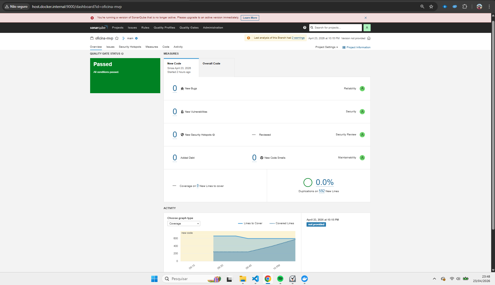
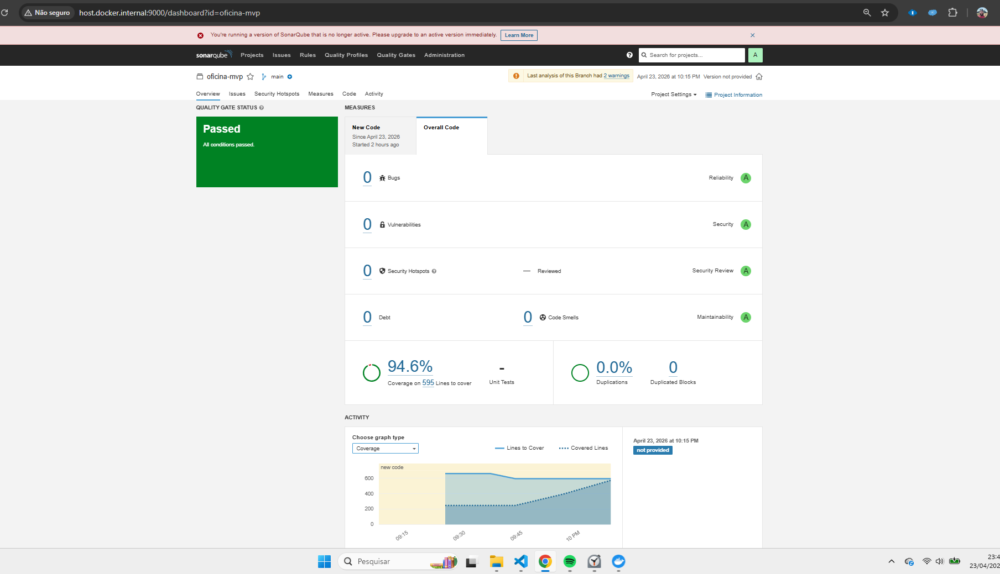
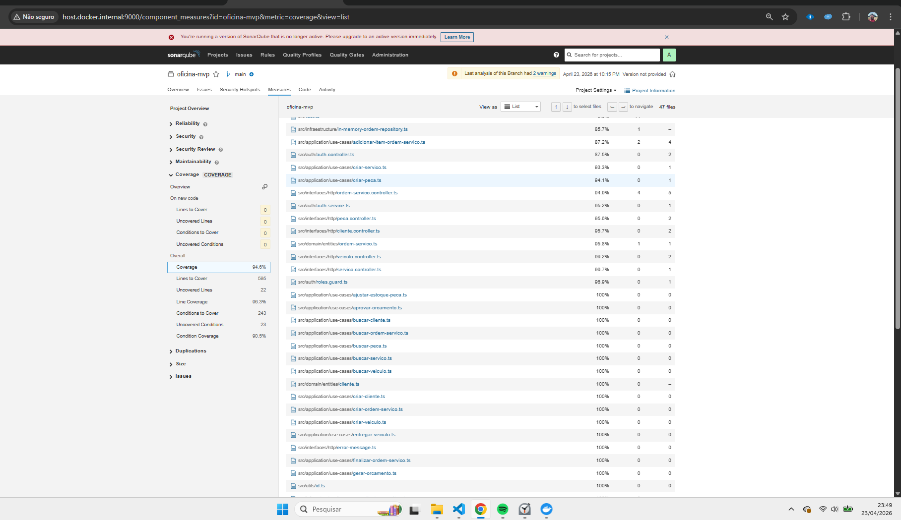

# Relatório SonarQube - Oficina MVP

Documento de apoio para a entrega final. Este relatório consolida a execução mais recente do SonarQube realizada durante a sessão, com foco na evidência de qualidade do repositório.

## Identificação

- Projeto: `oficina-mvp`
- Dashboard: `http://localhost:9000/dashboard?id=oficina-mvp`
- Scanner utilizado: `sonarsource/sonar-scanner-cli 8.0.1.6346`
- Execução do scanner: `EXECUTION SUCCESS`
- Resultado da análise: `ANALYSIS SUCCESSFUL`
- Comando executado:

```powershell
docker run --rm -e SONAR_HOST_URL="http://host.docker.internal:9000" -e SONAR_TOKEN="<TOKEN>" -v "${PWD}:/usr/src" sonarsource/sonar-scanner-cli
```

## Snapshot de qualidade

### Cobertura local de referência

Gerada em `npm run test:cov` e usada como base de cobertura para importação no Sonar.

- Statements: `91.96%`
- Branches: `88.35%`
- Functions: `97.56%`
- Lines: `92.14%`

### Cobertura observada no Sonar para os controllers críticos

Última leitura validada durante a sessão:

- `src/interfaces/http/ordem-servico.controller.ts`: `94.9%`
- `src/interfaces/http/peca.controller.ts`: `95.6%`
- `src/interfaces/http/servico.controller.ts`: `96.7%`

## Métricas de qualidade

Na coleta final desta revisão, os valores abaixo não puderam ser reconfirmados via API local do Sonar porque o serviço não estava acessível no ambiente de terminal naquele momento.

- Bugs: não reconfirmado nesta coleta
- Vulnerabilities: não reconfirmado nesta coleta
- Code Smells: não reconfirmado nesta coleta
- Quality Gate: não reconfirmado nesta coleta
- Duplicated Lines Density: não reconfirmado nesta coleta
- Security Hotspots: não reconfirmado nesta coleta

## Observações técnicas

- O scanner reconheceu o arquivo `coverage/lcov.info` corretamente.
- A análise TypeScript do Sonar registrou o warning conhecido sobre `resolvePackageJsonExports` com Node 22, mas a análise foi concluída com sucesso.
- A cobertura dos controllers que estavam em 0% foi efetivamente incrementada pelos novos testes adicionados ao repositório.

## Conclusão executiva

O trabalho de qualidade foi executado e validado localmente com teste, cobertura e reexecução do scanner. Este relatório serve como registro textual da análise mais recente e deve ser lido em conjunto com `DOCUMENTACAO_ARQUITETURA.md`.

## Evidencia de execução do SonarQube:



